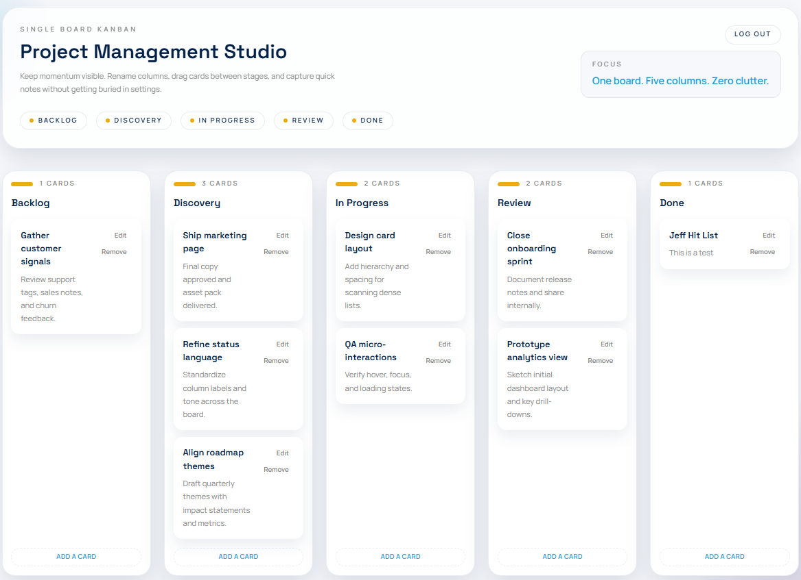

# Project Management Studio

A project management web app: a single-board Kanban with a built-in AI assistant that can create, edit, and move cards through chat. It runs locally as a single Docker container.




## Features

- **Sign in** to reach your board, sign out to leave it
- **Kanban board** with five columns whose titles can be renamed
- **Cards** you can create, edit inline, delete, and drag between columns
- **AI assistant** in a sidebar that can create, edit, and move one or more cards in response to chat
- **Persistent storage** so your board survives restarts

## Technology

### Frontend

| Technology | Purpose |
| --- | --- |
| Next.js 16 (App Router) | React framework, exported to a static site |
| React 19 | UI components |
| TypeScript 5 | Typed application code |
| Tailwind CSS 4 | Styling and design tokens |
| dnd-kit | Drag-and-drop for cards and columns |
| Vitest + Testing Library | Unit tests |
| Playwright | End-to-end tests |

### Backend

| Technology | Purpose |
| --- | --- |
| FastAPI | HTTP API and static file serving |
| Uvicorn | ASGI server |
| Python 3.13 | Backend runtime |
| uv | Dependency and environment management |
| Starlette SessionMiddleware | Signed, httpOnly session cookies |
| Pydantic | Request and board validation |
| SQLite (stdlib `sqlite3`) | Storage |
| pytest | Backend tests |

### AI

| Technology | Purpose |
| --- | --- |
| OpenRouter | Model gateway |
| OpenAI SDK | Client for the OpenRouter endpoint |
| `openai/gpt-oss-120b` | Model that reads the board and returns replies and board updates |

### Packaging

| Technology | Purpose |
| --- | --- |
| Docker (multi-stage build) | Builds the frontend, then serves it and the API from one image |
| Docker Compose | Runs the container and a named volume for the database |

The backend serves the API under `/api/*` and the exported frontend at `/`, so the whole app is one origin on one port. See [docs/ARCHITECTURE.md](docs/ARCHITECTURE.md) and [docs/DATABASE.md](docs/DATABASE.md) for details.

## Getting started

### Prerequisites

- [Docker](https://www.docker.com/) (Docker Desktop or Docker Engine with Compose)
- An [OpenRouter API key](https://openrouter.ai/keys)

### Setup

```bash
# 1. Clone the repository
git clone https://github.com/lenamonj/project-mgmt-kanban.git
cd project-mgmt-kanban

# 2. Create your environment file and add your OpenRouter key
cp .env.example .env
# then edit .env and set OPENROUTER_API_KEY

# 3. Start the app
#    macOS / Linux:
./scripts/start.sh
#    Windows:
scripts\start.bat
```

Open <http://localhost:8000> and sign in with:

- **Username:** `user`
- **Password:** `password`

Stop the app:

```bash
# macOS / Linux
./scripts/stop.sh
# Windows
scripts\stop.bat
```

## Usage

- **Board** - rename a column by editing its title; add a card with the form at the bottom of a column; edit or delete a card with its buttons; drag a card within or between columns. Changes are saved automatically.
- **Assistant** - open the sidebar with "Ask the assistant" and request changes such as "add a card to Review for the launch checklist" or "move everything in Backlog to Done". When the assistant changes the board, it refreshes automatically. Replies typically take 20-50 seconds, as the model reads and returns the full board on each request.

## Configuration

Environment variables (see `.env.example`):

| Variable | Required | Description |
| --- | --- | --- |
| `OPENROUTER_API_KEY` | Yes | API key for the AI assistant |
| `SESSION_SECRET` | No | Signing key for the session cookie; a development default is used if unset |
| `DB_PATH` | No | SQLite file path; set automatically in Docker |

## Development

Run the frontend and backend directly for faster iteration.

```bash
# Frontend (http://localhost:3000)
cd frontend
npm install
npm run dev

# Backend (http://localhost:8000)
cd backend
uv sync
uv run uvicorn app.main:app --reload
```

### Tests

```bash
# Backend (from backend/)
uv run pytest

# Frontend unit tests (from frontend/)
npm run test:unit

# Frontend end-to-end tests (from frontend/) - builds the app and runs it via the backend
npm run test:e2e
```

## Project structure

```
.
├── backend/            FastAPI app, database, AI client, tests
│   └── app/            main.py, db.py, seed.py, ai.py, static/
├── frontend/           Next.js app (App Router), components, tests
│   └── src/            app/, components/, lib/
├── scripts/            start/stop scripts for macOS, Linux, Windows
├── docs/               architecture and database documentation
├── Dockerfile          multi-stage build (frontend + backend)
└── docker-compose.yml  container and database volume
```
